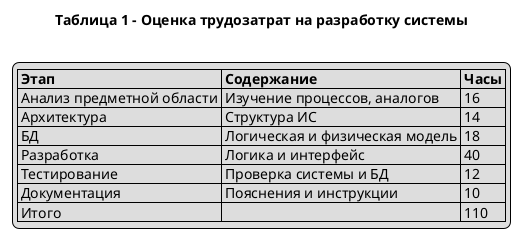
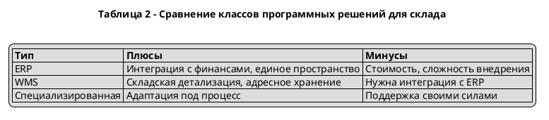

# PlantUML для отчёта (склад / ПМ.02)

## Диаграммы (IDEF0, DFD, UML)

| Файл | Соответствует PNG в `figures/` |
|------|--------------------------------|
| `diagram_01_idef0_A0.puml` | `01_IDEF0_A0_склад.png` — контекст A-0 |
| `diagram_02_dfd_context.puml` | `02_DFD_контекст.png` — DFD уровень 0 |
| `diagram_03_dfd_level1.puml` | `03_DFD_уровень1.png` — декомпозиция |
| `diagram_04_uml_classes.puml` | `04_UML_классов.png` — классы предметной области |
| `diagram_05_architecture_layers.puml` | **нет готового PNG** — трёхуровневая архитектура (подпись вида «рис. … архитектура и взаимодействие уровней») |

**Замечания:**

- Чистый **IDEF0** с «рогами» ИСРМ в PlantUML не рисуется нативно; здесь — **UML-блоки** с тем же смыслом (вход/выход/управление/механизм). Для строгого IDEF0 используй Bizagi Modeler / Visio / Draw.io.
- **DFD:** процессы — `usecase` (эллипс), внешние сущности — `rectangle`, хранилища — `rectangle` со стереотипом `<<store>>`.

## Таблицы (Salt)

- `table_01_labor.puml` — оценка трудозатрат (как в генераторе Word).
- `table_02_compare.puml` — сравнение типов решений (ERP / WMS / спец. система).

## Как получить PNG/SVG

Локально (нужен [PlantUML](https://plantuml.com/download) + Java):

```bash
cd /workspace   # или корень своего клона репозитория
plantuml -charset UTF-8 -tpng figures/plantuml/*.puml
# при необходимости SVG:
plantuml -charset UTF-8 -tsvg figures/plantuml/*.puml
```

Онлайн: вставь содержимое `.puml` на [plantuml.com/plantuml](https://www.plantuml.com/plantuml/uml/).

## Вариант через Creole (внутри диаграммы UML)

Если Salt не подходит, можно вставить таблицу в заметку:



Для заголовков колонок в Creole используется строка с `|= ... |=`.

### Таблица 2 (Creole)


