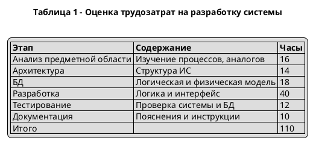
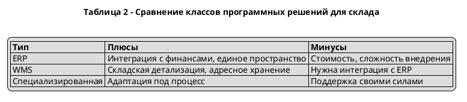

# Таблицы в PlantUML (Salt)

Файлы:

- `table_01_labor.puml` — оценка трудозатрат (как в генераторе Word).
- `table_02_compare.puml` — сравнение типов решений (ERP / WMS / спец. система).

## Как получить PNG/SVG

Локально (нужен [PlantUML](https://plantuml.com/download) + Java):

```bash
plantuml -charset UTF-8 -tpng figures/plantuml/table_01_labor.puml
plantuml -charset UTF-8 -tpng figures/plantuml/table_02_compare.puml
```

Онлайн: вставь содержимое `.puml` на [plantuml.com/plantuml](https://www.plantuml.com/plantuml/uml/).

## Вариант через Creole (внутри диаграммы UML)

Если Salt не подходит, можно вставить таблицу в заметку:



Для заголовков колонок в Creole используется строка с `|= ... |=`.

### Таблица 2 (Creole)


